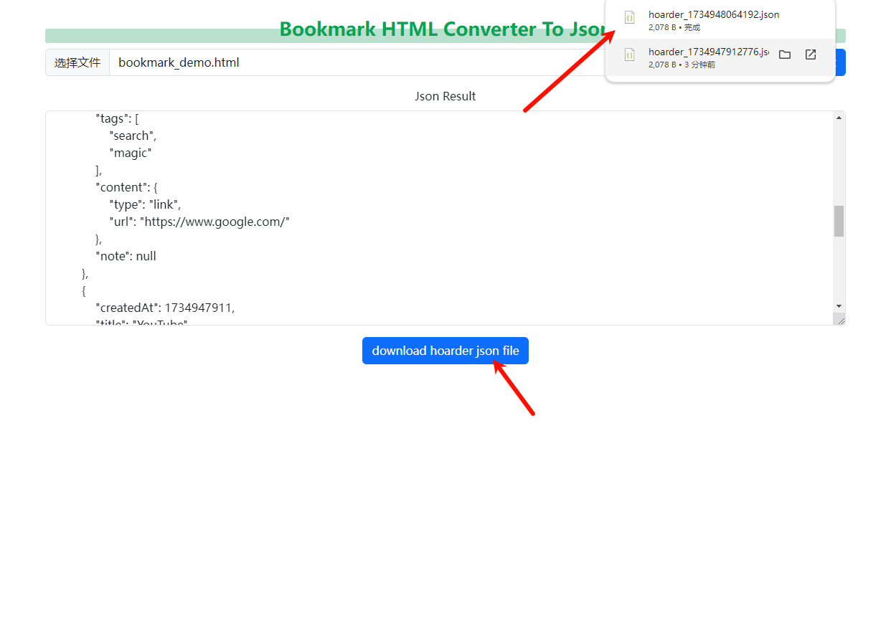

## Use

[WebSite](https://wumortal.github.io/HoarderHTMLConverterJson/)

1. export `Chrome` `Edge` bookmark

2. select bookmark `HTML` File

3. click `Convert` button

4. click `download hoarder json` button

5. import `hoarder_xxx.json` to `Hoarder`

## Development

clone `repo` and open `visual studio code`